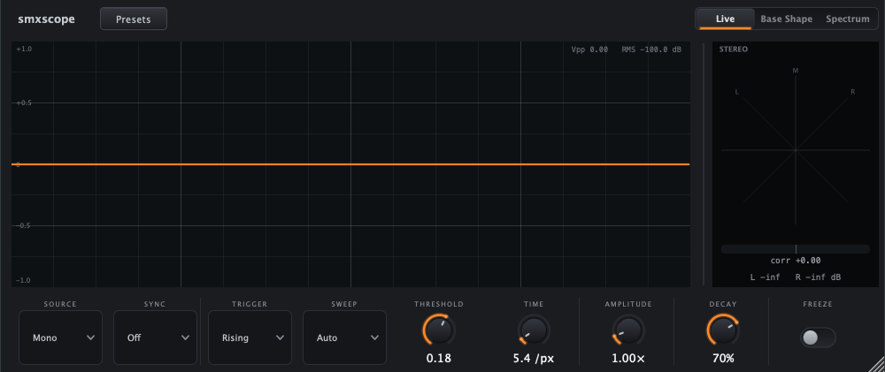

# Cycloscope

[](https://github.com/EyalDelarea/Cycloscope/actions/workflows/ci.yml)
[](https://github.com/EyalDelarea/Cycloscope/releases)
[](LICENSE)


**A waveform / single-cycle / spectrum / stereo analyzer plugin for macOS.** It passes audio
through untouched and visualizes it — and its standout trick (**Base Shape**) locks a periodic
source (saw, sine, supersaw) into a **stationary single cycle** so you can read its true shape
instead of a scrolling blur. Inspired by classic single-cycle oscilloscope tools.

Built in **JUCE 8** · **VST3 + AU + Standalone** · universal (Apple Silicon + Intel).



## Features

**Three display modes** (top toggle):

- **Live** — real-time triggered/scrolling waveform.
  - **Trigger:** Free / Rising / Falling with adjustable **Threshold** (sub-sample, hysteresis).
  - **Sweep:** Auto (free-run) / Normal (hold until trigger) / Single (capture one frame).
  - **Sync:** lock the window to host tempo — Off / 1·4 / 1·2 / 1 Bar.
  - **Time** (samples/pixel) and **Amplitude** zoom; live **Vpp** + **RMS dB** readout.
- **Base Shape** — auto-detects pitch (McLeod / NSDF) and **phase-locks + averages many cycles
  into one clean, stationary waveform**. **Cycles** sets how many periods to show, with a pitch /
  note / clarity readout. Detuned/unison sources (supersaw) snapshot in place. **A / B** capture
  two cycles to overlay-compare, and **Export** writes the held cycle as a 2048-sample wavetable WAV.
- **Spectrum** — 2048-point FFT (Hann), log-frequency axis, dB grid, smoothed magnitude.

**Always-on stereo goniometer** (resizable side panel): X-Y Lissajous with peak scaling and
phosphor persistence (**Decay**), a **correlation meter** and **L/R level** readout with meter
ballistics. **Source** selects what the main scope shows: Mono / Left / Right / Side / Stereo.

**Presets** (factory + your own), **Freeze**, full host automation + state recall, embedded
Inter typeface, and a dark UI with glowing-arc knobs.

## Installation

Cycloscope is **not code-signed or notarized** — the project doesn't pay for an Apple Developer
account, so macOS will warn that "the developer cannot be verified." **This is expected.** The
source is all here, and every release ships a `SHA256SUMS.txt` you can verify.

### Recommended — ZIP

1. Download `Cycloscope-<version>-macOS.zip` from the [Releases page](../../releases).
2. (Optional, recommended) verify it: `shasum -a 256 -c SHA256SUMS.txt`
3. Unzip and copy the bundles into your user plug-in folders:
   - `Cycloscope.vst3` → `~/Library/Audio/Plug-Ins/VST3/`
   - `Cycloscope.component` → `~/Library/Audio/Plug-Ins/Components/`
4. **Clear the macOS quarantine flag** (required — otherwise your DAW silently skips the plugin):
   ```bash
   xattr -dr com.apple.quarantine ~/Library/Audio/Plug-Ins/VST3/Cycloscope.vst3
   xattr -dr com.apple.quarantine ~/Library/Audio/Plug-Ins/Components/Cycloscope.component
   ```
5. Rescan plugins in your DAW.

### Alternative — PKG installer

1. Download `Cycloscope-<version>-macOS.pkg` and double-click it.
2. macOS blocks it ("Apple cannot check it for malicious software"). Open
   **System Settings → Privacy & Security**, scroll down, click **Open Anyway**, then run the
   installer again. If it still refuses:
   `xattr -dr com.apple.quarantine ~/Downloads/Cycloscope-*.pkg`

> **Why unsigned?** Signing requires a paid Apple Developer account. The trade-off is the
> warning above; the upside is the code is fully open and reproducible. Prefer to be sure?
> Build it yourself below.

## Build from source

Requirements: macOS, CMake ≥ 3.22, Apple Command Line Tools. JUCE 8 is fetched by CMake.

```bash
cmake -B build -G "Unix Makefiles"
cmake --build build -j8            # Standalone + VST3 + AU
```

`COPY_PLUGIN_AFTER_BUILD` installs to `~/Library/Audio/Plug-Ins/{VST3,Components}`.
See [`CONTRIBUTING.md`](CONTRIBUTING.md) for details and [`RELEASING.md`](RELEASING.md) for packaging.

## Tests

DSP is header-only and unit-tested headlessly (8 suites: RingBuffer, Trigger, PeriodDetector,
CycleAverager, SignalUtils, PhaseAlign, NoteName, StereoUtils):

```bash
ctest --test-dir build --output-on-failure
auval -v aufx Cycl Eyal      # → AU VALIDATION SUCCEEDED
```

## Usage notes

- Cycloscope is a transparent passthrough — place it **after** any effect whose output you want
  to see (e.g. *after* a stereo widener/delay to read its image).
- **Base Shape shows the post-filter audio**, so open your synth's filter to see the raw
  oscillator harmonics — a low filter turns a saw into a near-sine, and Cycloscope shows that truthfully.

## Architecture

- **Audio thread** (`PluginProcessor`): writes L/R into lock-free `RingBuffer`s, passes audio
  through unchanged, and reads host BPM from the playhead. Buffers are allocated once in the
  constructor (no realloc race with the editor).
- **GUI thread** (`ScopeComponent`, `GoniometerComponent`): 60 fps timers snapshot the buffers
  and run pure DSP (trigger search, MPM pitch, phase-locked averaging, FFT, Lissajous); static
  grid + phosphor layers are cached to `juce::Image`.
- Parameters via `AudioProcessorValueTreeState`. All DSP units are header-only and JUCE-free.

## Contributing & conduct

Issues and PRs welcome — see [`CONTRIBUTING.md`](CONTRIBUTING.md),
[`CODE_OF_CONDUCT.md`](CODE_OF_CONDUCT.md), and [`SECURITY.md`](SECURITY.md).

## License

**GPL-3.0** — see [`LICENSE`](LICENSE). This follows from linking JUCE 8 under its free tier.
Third-party attributions are in [`NOTICE.md`](NOTICE.md) (JUCE — GPLv3; Inter typeface —
SIL OFL 1.1).
